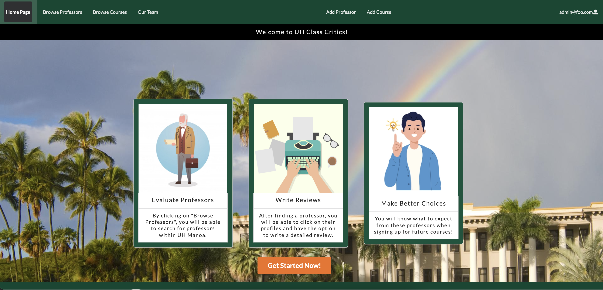
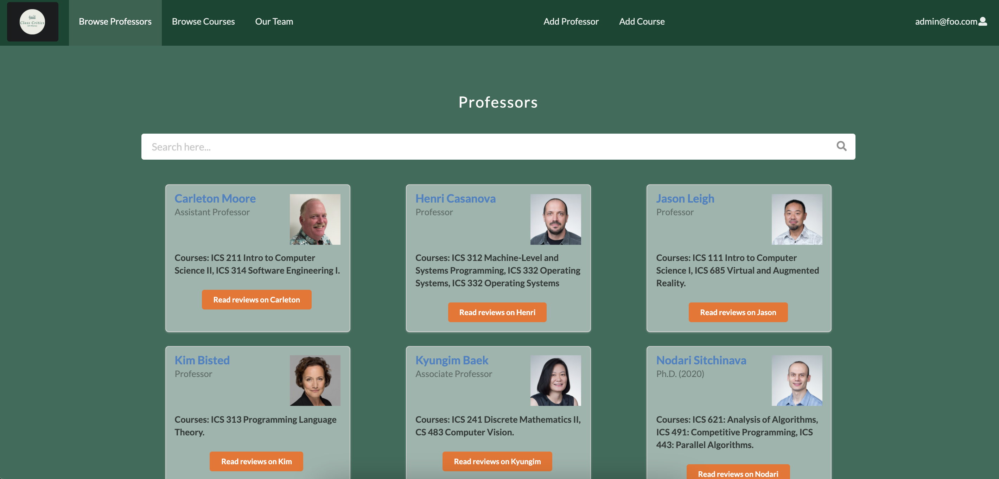
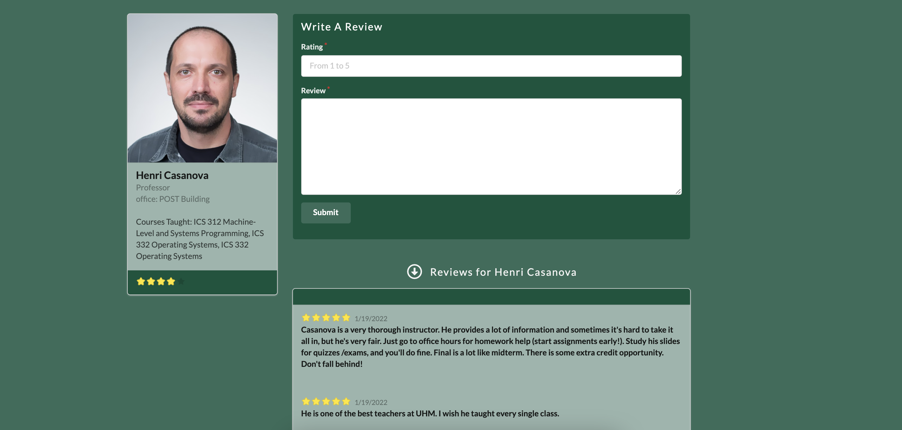
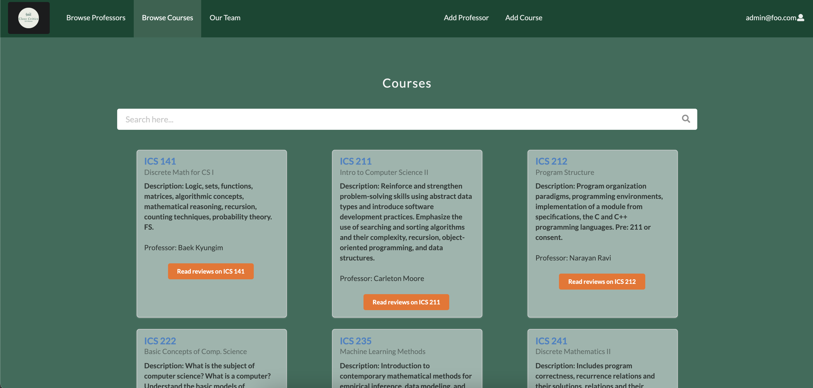
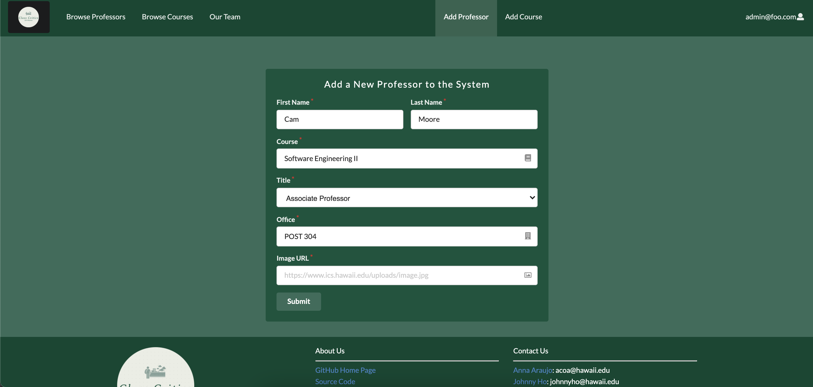
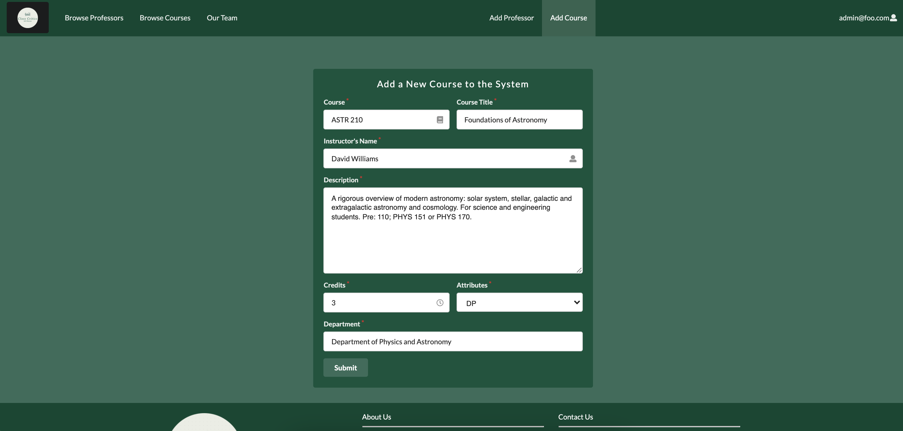

## Table Of Contents

* [Overview](#overview)
* [Links](#links)
* [User Guide](#user-guide)
* [Developer Guide](#developer-guide)
* [Development History](#development-history)
* [Community Feedback](#community-feedback)
* [Team](#team)

## Overview

The quality professors and instructors nowadays, especially in higher education, is important for students to learn and succeed. Although we recognize the importance of the role played by educators, most educational systems still have difficulty finding a fair evaluation for their professors and courses. UH Class Critics is a website that allows students from the University of Hawaii at Manoa to share their experiences taking different courses and professors at UH. They will be allowed to write reviews and rate instructors from the campus similar to [RateMyProfessor](https://www.ratemyprofessors.com/). Students will have access to a collection of professors and courses and can evaluate them based on a rating scale of 1-5. The website allows students to share their feedback (positive or negative) and provide others with the proper expectations when registering for courses.

Our goal is to provide a convenient and readily accessible website where students can research and make the best decisions about courses they plan to take based on the feedback of others. We also want users to share their experiences with the courses and professors taken and critique them. The inspiration for the project came from the lack of information when it comes to choosing courses and teachers at the beginning of each semester where students have to choose and carefully plan the courses they will take. With UH Class Critics, it will be possible to research courses and educators in the areas of business, health, economics, technology and marketing, and many more. Although there will always be some uncertainty with taking a new course, having some basic idea or expectation for a course is something that is increasingly valuable for students to make the best choices during their academic journey.

As we progress through the development of this web application, our vision for the layout of UH Class Critics will reflect the following features and pages:

- Landing Page
- Sign in/Sign up Page
- Browse Professor Page
- Professor Overview Page
- Review Professor Page
- Courses Page

## Why Should We Review Professors and Their Courses?

In general, all professors expect their students to develop complex skills in the most diverse areas and disciplines. Making these expectations come true involves the ability of students to assess classes they are currently enrolled in and their instructors. A teaching strategy must always be subject to evaluation, both to improve the work for those already in the classroom and to promote the entry of those who are still thinking of taking a particular course. 

The data obtained from the reviews are generally used as constructive comments that serve to assess the development of a teacher. In this way, professors who are underperforming will have the opportunity to self-assess, improve their performance, and help to maintain the quality of an educational institution. When students are satisfied with the methodology, they will identify the most efficient teachers to always maintain the high quality of the education.

## Links

Our deployed application can be found here at [class-critics.xyz](https://class-critics.xyz/)

Our UH Class Critics GitHub Organization can also be found at here at [GitHub](https://github.com/uh-class-critics)

## User Guide

This section will provide a brief walkthrough of the UH Class Critics website and its features.


### Landing Page

The first page that is seem when visiting our website will be the following. It allows users to grasp the concept of our website and be able to login and sign up.



### Professor Overview Page

Students who have taken those classes will be able to view information about the professor like their ratings, reviews, courses taught, etc. 



### Professor Review Page

Student can write the review for a professor and rate the professor on this page. Below the Write a Review section is the previous reviews of the professor. 



### Browse Courses Page

Within the Browse Courses Page, students will be able to select a course and then it will display a page that displays the course information and reviews.



### Sign Up Page

New incoming users will be able to register for an account at UH Class Critics if they don't have one.


### Sign In Page

Returning users can log in here and keep using our features!


### Team 

This page displays the informations of developers who have worked on the project. 


## Admin Functionality
If you have admin features on this website, there are a few differences that you may notice when logging in. The first thing you will notice is changes in the navbar where two new options appear. When clicking on Add Professor, the admin will be able to input a new professor into the database for reviewing. Regular users will be able to see a new professor in the same format as the professors already listed in the browse professors page.



Similarly to Add Professor, clicking on Add Courses will provide a similar experience for the admin. New courses added by the admin will also be provided for regular users in the same format as previously input courses.



## Developer Guide

For Meteor developers who would like to use our project as a template for their own projects and ideas, Here is how you can get started:

1. Install [Meteor](https://www.meteor.com/install)
2. Visit our [UH Class Critics](https://github.com/uh-class-critics/uh-class-critics) (make sure you are signed in) and click the green Code button to clone the application to your local system.
3. Using a local terminal or powershell, change directories to the app directory and invoke ```$ meteor npm install```
4. After verifying installation of libraries and packages, you will be able to run the application by running ```$ meteor npm run start```
5. You should now be able to see the running web application at your at [http://localhost:3000](http://localhost:3000). Within the ```/config/settings.development.json``` path, you can find default information for users to log in

## Development History

For this project, we are using GitHub's built in projects feature to track our progress through Milestones.

* [Milestone 1](https://github.com/uh-class-critics/uh-class-critics/projects/1)
* [Milestone 2](https://github.com/uh-class-critics/uh-class-critics/projects/3)
* [Milestone 3](https://github.com/uh-class-critics/uh-class-critics/projects/4)

## Community Feedback

Overall, seeing as the reviewers are students themselves, having used ratemyprofessors is expected of them. They were able to use the website with a great amount of ease with this experience. All of the reviewers not being in the ICS department took a toll on the functionality part of the survey. Thanks to meteor-application-template-react the website is a lot cleaner than it would have been without it, so the cleanliness score is quite high.

Functionality: 3
> Seeing as it only includes the ICS, I do not see how the site could be useful to me in its current state as I am an Architecture major. If the team decides to expand on its selection, then I could see myself seeing this website. Like a farmers market, buying products that were made for the people, by the people, does have its merits. For now, I'll stick to ol' reliable, ratemyprofessors.

Ease-of-Use: 5
> Pretty intuitive, just click the Professors tab at the top, choose one, and write a review. There really is nothing to mess up.

Cleanliness: 5
> Easy on the eyes, not too much clutter. I like how having a background picture on the page did not become a theme and was just present on a few pages.

- Taylee Kelly

Functionality: 4
> Would give full marks if I were minoring in ICS, however I have no plan to do so. The site does what the team set out to make it do.

Ease-of-Use: 5
> Without any instruction, I was able to navigate the site freely without feeling lost.

Cleanliness: 5
> On pages without a bunch of objects, there's a background image to fill the empty space, and on pages with a bunch of stuff, the page just has that stuff without a background image. Idk if that was intended but seems like a good choice.

- Kaila Pojas

Functionality: 5
> It does what I was told it was supposed to do. Not only can you critique classes, as suggested by its name, but you can also critique professors. 

Ease-of-Use: 5
> Since I've used ratemyprofessors before, using this website was a breeze. 

Cleanliness: 4
> It's clean, but it's pretty empty to begin with. Some stuff could have been placed better but overall nothing is in the way to worsen the experience. 

- Shelby Hom

Functionality: 3
> I am not an ICS student so I have no say in how a professor in this field performs. Although I am not unable to submit a review, solely based on this discrepancy, I must dock points for functionality. For a site called UH Class Critics, being only able to critique classes of one department of UH seems laughable. Overall, seems like a decent website.

Ease-of-Use: 4
> Pretty simple, nothing too complex. It's like filling out a Google Form or something. 

Cleanliness: 2
> It's clean in the same way an apartment that you just moved into is clean. 

- Harold Calventas

Functionality: 5
> I give a score, write a review, hit submit, and it stays there! Like an actual site. It's still there when I go to different pages. I was kinda spooked when I was told to press F12, but seeing all this stuff like "Meteor" and "Minimongo" was kinda fascinating.

Ease-of-Use: 5
> Simple site simple use. The labeled tabs at the top tell you exactly where you're going and there was never a feeling of like breaking the site. Multiple ways of getting to the same page seems kind of redundant but at the same time user friendly in a sense.

Cleanliness: 4
> Clean but looks generic. Like it uses a template or something, but there's nothing wrong with that. Maybe in the future things could be customized further or something like that.

- Valerie Suelen

## Team

[UH Class Critics](https://github.com/uh-class-critics/uh-class-critics) will be designed, implemented, and maintained by 
- [Ana Araujo](https://acatarinaoaraujo.github.io/)
  - Hi, I am Ana. I am an undergraduate student enrolled at the University of Hawaii at Manoa. I am in my junior year, expecting to graduate in Spring 2022. My interests are Software Development, Criminal Justice, and Economy.
- [Steven Le](https://sle417.github.io/)
  - Currently a sophomore studying Computer Science at UH Manoa. I have interests in software engineering, computer graphics, information technology and plan to graduate in Spring 2023. 
- [John Suelen](https://johnsuelen.github.io/)
  - Sophomore, ICS, UH Manoa, Interests: Video Games, Software Development, Game Development, Plan to graduate in Spring 2023
- [Johnny Ho](https://johnny-ho1.github.io/)
  - Currently a Sophmore at UH Manoa, interested in data science, data mining, game development and plan to graduate in Spring 2023.
- [Zi Jun Huang](https://zijunhuang-1.github.io/)
  - Current a Junior at UH Manoa, interested in UI/UX design, expected to graduated Spring 2022.
