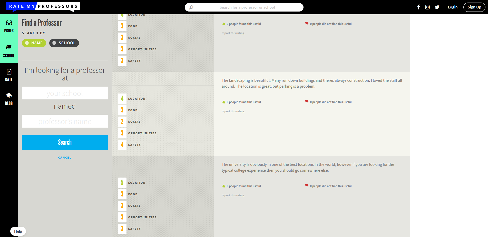
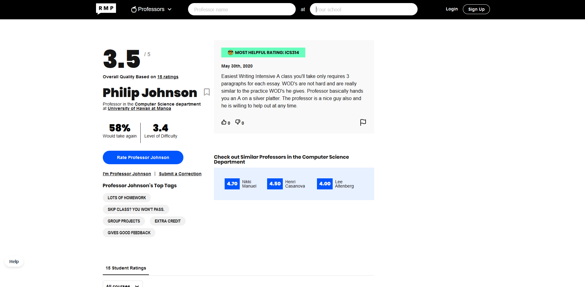

## Overview

UH Class Critics a service that allows students from the University of Hawaii at Manoa to share their experiences taking different college courses and professors and rating them, similar to [RateMyProfessor](https://www.ratemyprofessors.com/).

Our goal is to provide a convenient and readily accessible website where students can research and make the best decisions about courses they plan to take based on the reviews as well as share their experiences with the courses and professors already taken and critiquing them.

### Current Vision for Development

Currently, we are in the stage of developing this service for all students at UH. Our vision for the layout of this service will reflect features such as:

- Landing Page
- Sign in/Sign up Page
- Browse Classes Page
- Review Course Page
- Review Professor Page

Generally, we would like each review to have:

- The semester the course was taken.
- The class name
- The professor’s name
- Various star ratings (Difficulty, Importance to major, etc)
- A textual description of the course.
- Cost of course (materials, textbooks, etc.)
- Average number of hours spent studying per week.

Ideally, we want our service to look something like the following:

Course Review Page

Professor Page

Write Review Page

