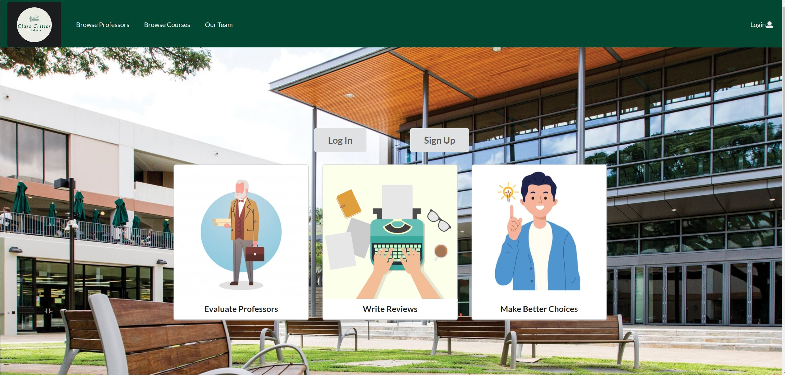
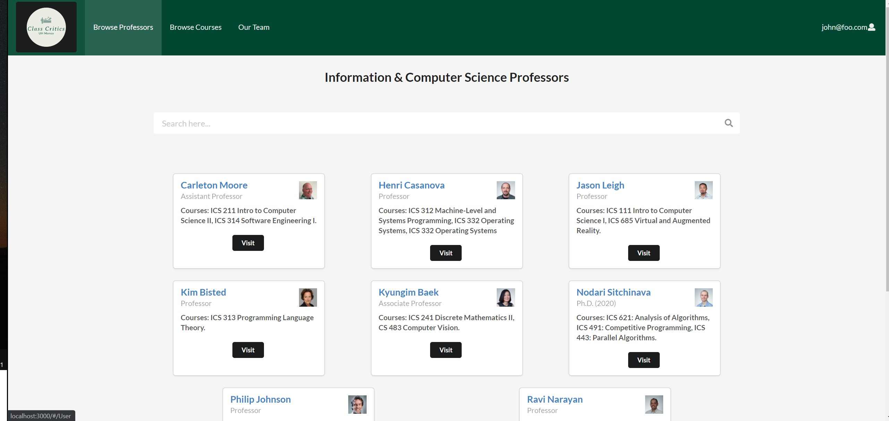
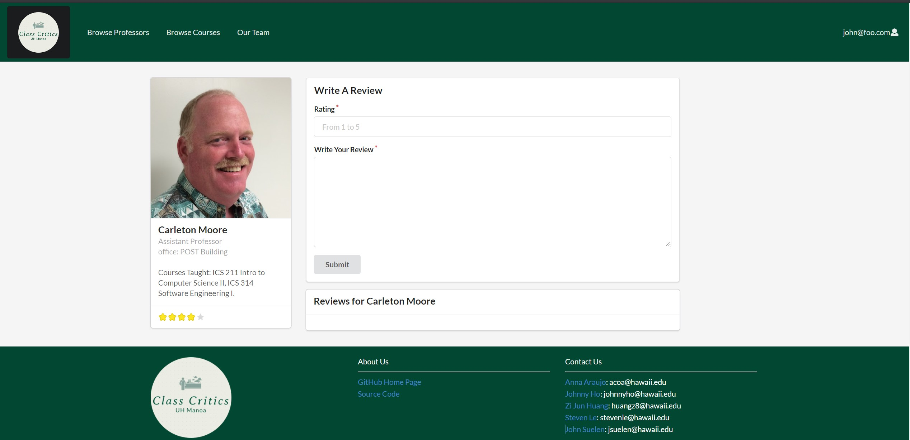
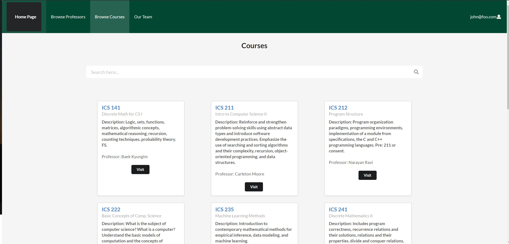
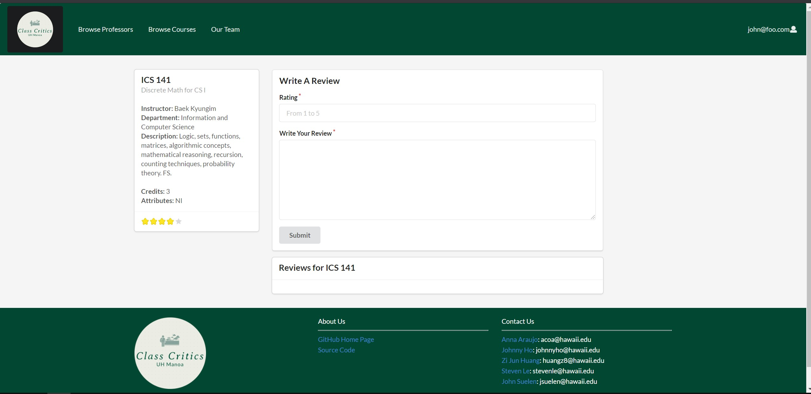
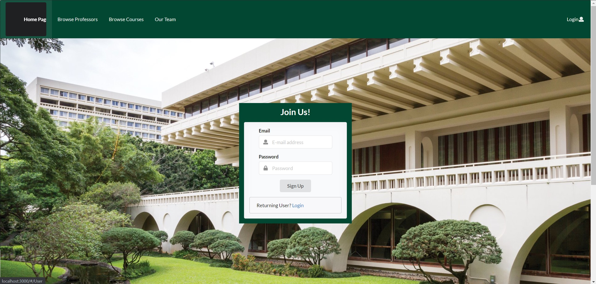
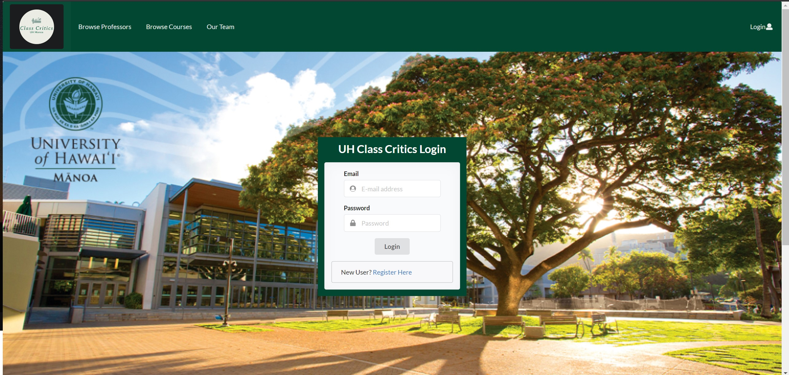

## Table Of Contents

* [Overview](#overview)
* [Links](#links)
* [User Guide](#user-guide)
* [Developer Guide](#developer-guide)
* [Development History](#development-history)
* [Team](#team)

## Overview

The quality professors and instructors nowadays, especially in higher education is important for students to learn to the best of their ability and succeed. Although we recognize the importance of the role played by educators, most educational systems still have difficulty finding a fair evaluation for their professors and courses. UH Class Critics is a website that allows students from the University of Hawaii at Manoa to share their experiences taking different courses and professors at UH allowing them to write reviews and rate instructors from the campus similar to [RateMyProfessor](https://www.ratemyprofessors.com/). Students will have access to a collection of professors and courses and can evaluate them based on criteria they care about. The website allows students to share their feedback (positive or negative) and provide others with the proper expectations when registering for courses.

Our goal is to provide a convenient and readily accessible website where students can research and make the best decisions about courses they plan to take based on the feedback of others as well as share their experiences with the courses and professors taken and critiquing them. The inspiration for the project came from the lack of information when it comes to choosing courses and teachers at the beginning of each semester where students have to choose and carefully plan the courses they will take. With UH Class Critics, it will be possible to research courses and educators in the areas of business, health, economics, technology and marketing, and many more. Although there will always be some uncertainty with taking a new course, having some basic idea or expectation for a course is something that is increasingly valuable for students to make the best choices during their academic journey.

As we progress through the development of this web application, our vision for the layout of UH Class Critics will reflect the following features and pages:

- Landing Page
- Sign in/Sign up Page
- Browse Professor Page
- Professor Overview Page
- Review Professor Page
- Courses Page

## Why Should We Review Professors and Their Courses?

In general, all professors expect their students to develop complex skills in the most diverse areas and disciplines. Making these expectations come true involves the ability of students to assess classes they are currently enrolled in and their instructors. A teaching strategy must always be subject to evaluation, both to improve the work for those already in the classroom and to promote the entry of those who are still thinking of taking a particular course. 

The data obtained from the reviews are generally used as constructive comments that serve to assess the development of a teacher. In this way, professors who are underperforming will have the opportunity to self-assess, improve their performance, and help to maintain the quality of an educational institution. When students are satisfied with the methodology, they will identify the most efficient teachers to always maintain the high quality of the education.

## Links

Our deployed application can be found here at [class-critics.xyz](https://class-critics.xyz/)

Our UH Class Critics GitHub Organization can also be found at here at [github.com](https://github.com/uh-class-critics)

## User Guide

This section will provide a brief walkthrough of the UH Class Critics website and its features.


### Landing Page

The first page that is seem when visiting our website will be the following. It allows users to grasp the concept of our website and be able to login and sign up.



### Professor Overview Page

Students who have taken those classes will be able to view information about the professor like their ratings, reviews, courses taught, etc. 



### Professor Review Page

Student can write the review for a professor and rate the professor on this page. Below the Write a Review section is the previous reviews of the professor. 



### Browse Courses Page

Within the Browse Courses Page, students will be able to select a course and then it will display a page that displays the course information and reviews.



### Course Review Page

Student can write the review for a course and rate the course on this page. Below the Write a Review section is the pervious reviews of the course.  



### Sign Up Page

New incoming users will be able to register for an account at UH Class Critics if they don't have one.



### Sign In Page

Returning users can log in here and keep using our features!



### Team 

This page displays the informations of developers who have worked on the project. 


## Developer Guide

For Meteor developers who would like to use our project as a template for their own projects and ideas, Here is how you can get started:

1. Install [Meteor](https://www.meteor.com/install)
2. Visit our [UH Class Critics](https://github.com/uh-class-critics/uh-class-critics) (make sure you are signed in) and click the green Code button to clone the application to your local system.
3. Using a local terminal or powershell, change directories to the app directory and invoke ```$ meteor npm install```
4. After verifying installation of libraries and packages, you will be able to run the application by running ```$ meteor npm run start```
5. You should now be able to see the running web application at your at [http://localhost:3000](http://localhost:3000). Within the ```/config/settings.development.json``` path, you can find default information for users to log in

## Development History

For this project, we are using GitHub's built in projects feature to track our progress through Milestones.

* [Milestone 1](https://github.com/uh-class-critics/uh-class-critics/projects/1)
* [Milestone 2](https://github.com/uh-class-critics/uh-class-critics/projects/3)
* [Milestone 3](https://github.com/uh-class-critics/uh-class-critics/projects/4)

## Team

[UH Class Critics](https://github.com/uh-class-critics/uh-class-critics) will be designed, implemented, and maintained by 
- [Ana Araujo](https://acatarinaoaraujo.github.io/)
  - Hi, I am Ana. I am an undergraduate student enrolled at the University of Hawaii at Manoa. I am in my junior year, expecting to graduate in Spring 2022. My interests are Software Development, Criminal Justice, and Economy.
- [Steven Le](https://sle417.github.io/)
  - Currently a sophomore studying Computer Science at UH Manoa. I have interests in software engineering, computer graphics, information technology and plan to graduate in Spring 2023. 
- [John Suelen](https://johnsuelen.github.io/)
  - Sophomore, ICS, UH Manoa, Interests: Video Games, Software Development, Game Development, Plan to graduate in Spring 2023
- [Johnny Ho](https://johnny-ho1.github.io/)
  - Currently a Sophmore at UH Manoa, interested in data science, data mining, game development and plan to graduate in Spring 2023.
- [Zi Jun Huang](https://zijunhuang-1.github.io/)
  - Current a Junior at UH Manoa, interested in UI/UX design, expected to graduated Spring 2022.
