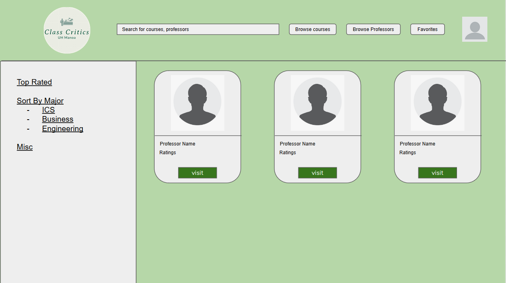
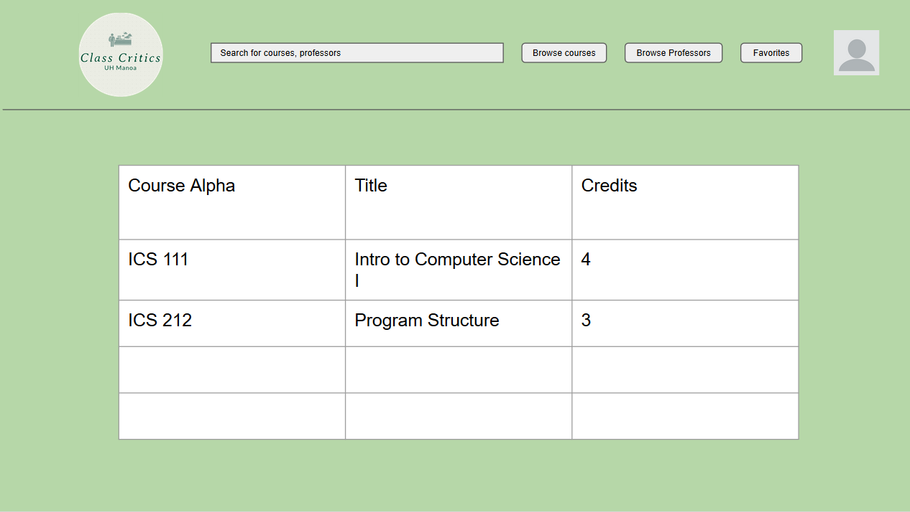
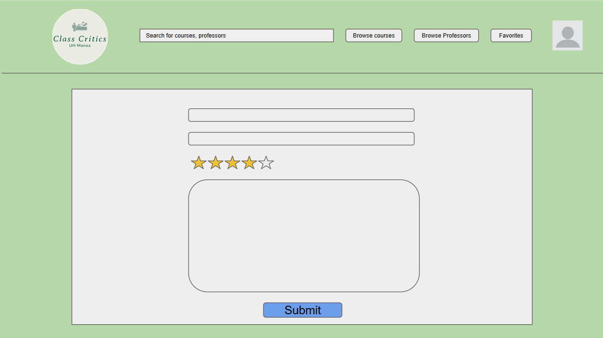
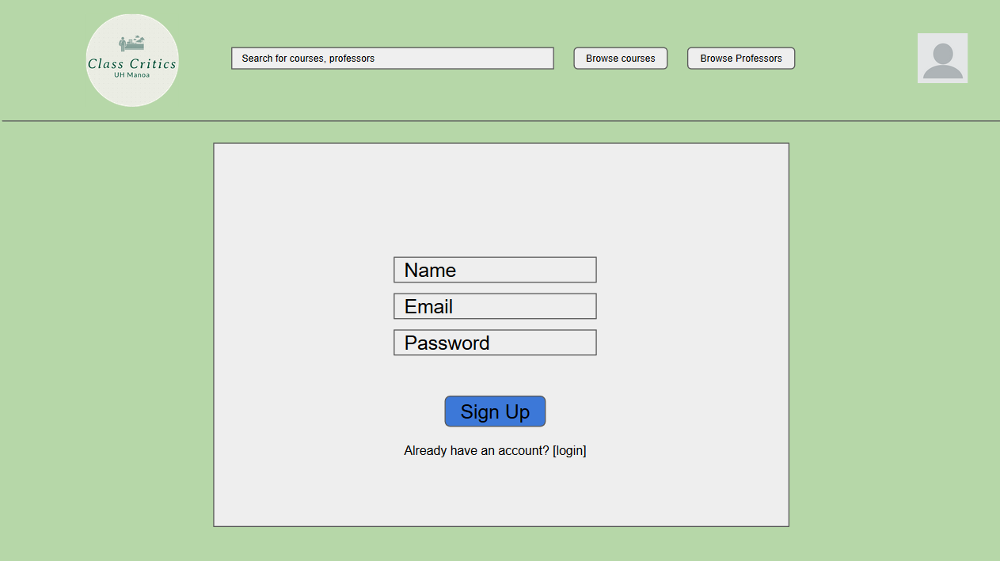

## Overview

The quality professors and instructors nowadays, especially in higher education is important for students to learn to the best of their ability and succeed. Although we recognize the importance of the role played by educators, most educational systems still have difficulty finding a fair evaluation for their professors and courses. UH Class Critics is a website that allows students from the University of Hawaii at Manoa to share their experiences taking different courses and professors at UH allowing them to write reviews and rate instructors from the campus similar to [RateMyProfessor](https://www.ratemyprofessors.com/). Students will have access to a collection of professors and courses and can evaluate them based on criteria they care about. The website allows students to share their feedback (positive or negative) and provide others with the proper expectations when registering for courses.

Our goal is to provide a convenient and readily accessible website where students can research and make the best decisions about courses they plan to take based on the feedback of others as well as share their experiences with the courses and professors taken and critiquing them. The inspiration for the project came from the lack of information when it comes to choosing courses and teachers at the beginning of each semester where students have to choose and carefully plan the courses they will take. With UH Class Critics, it will be possible to research courses and educators in the areas of business, health, economics, technology and marketing, and many more. Although there will always be some uncertainty with taking a new course, having some basic idea or expectation for a course is something that is increasingly valuable for students to make the best choices during their academic journey.

## Why Should We Review Professors and Their Courses?

In general, all professors expect their students to develop complex skills in the most diverse areas and disciplines. Making these expectations come true involves the ability of students to assess classes they are currently enrolled in and their instructors. A teaching strategy must always be subject to evaluation, both to improve the work for those already in the classroom and to promote the entry of those who are still thinking of taking a particular course. 

The data obtained from the reviews are generally used as constructive comments that serve to assess the development of a teacher. In this way, professors who are underperforming will have the opportunity to self-assess, improve their performance, and help to maintain the quality of an educational institution. When students are satisfied with the methodology, they will identify the most efficient teachers to always maintain the high quality of the education.

## Deployment

UH Class Critics is currently deployed on DigitalOcean and you can view our application [here](http://164.90.147.173/). Furthermore, for those who want to check out our template, our [GitHub repository](https://github.com/uh-class-critics/uh-class-critics) is also available for those who want to view our source code. 

As we progress through the development of this web application, our vision for the layout of UH Class Critics will reflect the following features and pages:

- Landing Page
- Sign in/Sign up Page
- Browse Professor Page
- Professor Overview Page
- Review Professor Page
- Courses Page

For each review that students will be able to write, we would like to implement the following fields for a complete review:

- The semester the course was taken.
- The class name
- The professor’s name
- Various star ratings (Difficulty, Importance to major, etc)
- A textual description of the course.
- Cost of course (materials, textbooks, etc.)
- Average number of hours spent studying per week.
- Final grade

Here is a sample of some of the pages we have developed during this project:

## Landing Page

## Browse Professors Page

Students will be able to look through a catalog of professors at UH Manoa and be able to sort instructors based on the department they work under.

## Browse Courses Page

With the dropdown functionality in the NavBar for Browse Courses, Students will be able to select a department and then it will display a page with courses specific for that department

## Professor Overview Page

Students who have taken those classes will be able to view information about the professor like their ratings, reviews, courses taught, etc. 

## Write Review Page

In this page, the student will be able to write reviews for the professor they have taken, giving them a rating, and providing feedback for other students who visit the professor's page.

## Sign Up Page

## Team

[UH Class Critics](https://github.com/uh-class-critics/uh-class-critics) will be designed, implemented, and maintained by 
- [Ana Araujo](https://acatarinaoaraujo.github.io/)
  - Hi, I am Ana. I am an undergraduate student enrolled at the University of Hawaii at Manoa. I am in my junior year, expecting to graduate in Spring 2022. My interests are Software Development, Criminal Justice, and Economy.
- [Steven Le](https://sle417.github.io/)
  - Currently a sophomore studying Computer Science at UH Manoa. I have interests in software engineering, computer graphics, information technology and plan to graduate in Spring 2023. 
- [John Suelen](https://johnsuelen.github.io/)
  - Sophomore, ICS, UH Manoa, Interests: Video Games, Software Development, Game Development, Plan to graduate in Spring 2023
- [Johnny Ho](https://johnny-ho1.github.io/)
  - Currently a Sophmore at UH Manoa, interested in data science, data mining, game development and plan to graduate in Spring 2023.
- [Zi Jun Huang](https://zijunhuang-1.github.io/)
  - Current a Junior at UH Manoa, interested in UI/UX design, expected to graduated Spring 2022.
